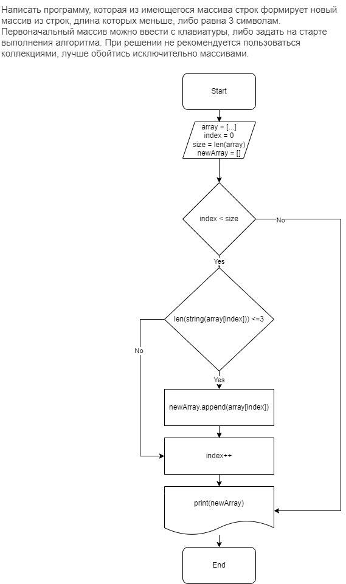

# Итоговая контрольная работа
## Задание
***
1. Создать репозиторий на GitHub
2. Нарисовать блок-схему алгоритма (можно обойтись блок-схемой основной содержательной части, если вы выделяете её в отдельный метод)
3. Снабдить репозиторий оформленным текстовым описанием решения (файл README.md)
4. Написать программу, решающую поставленную задачу
5. Использовать контроль версий в работе над этим небольшим проектом (не должно быть так, что всё залито одним коммитом, как минимум этапы 2, 3, и 4 должны быть расположены в разных коммитах)
***
## Реализация

1. Создан репозиторий на GitHub: 
```
https://github.com/mr-Prokofev/final-control-work.git
```
2. Блок схема нарисована при помощи сайта: https://app.diagrams.net/ и экспортирована в формате *.jpeg*


3. Описание блок-схемы:
* Входные данные: 
```
array = [...] // Исходный массив элементов
index = 0 // индекс для цикла
size = len(array) - размер массива
newArray = [] пустой массив для добавление элементов, удовлетворяющих условию.

```

* Проверка условия для прохождения по исходному массиву:
```
index < size
```

* Проверка 'элемента исходного массива на длинну строкого элемента:
```
len(string(array[index]))<=3 
```
* Если условия выполняется, элемент добавляется в новый массив *newArray*
* *index++* следующий элемент
* По прохождению всего исходного элемента, на экран для пользователя будет выведен новый массив удовлятворяющий условию.